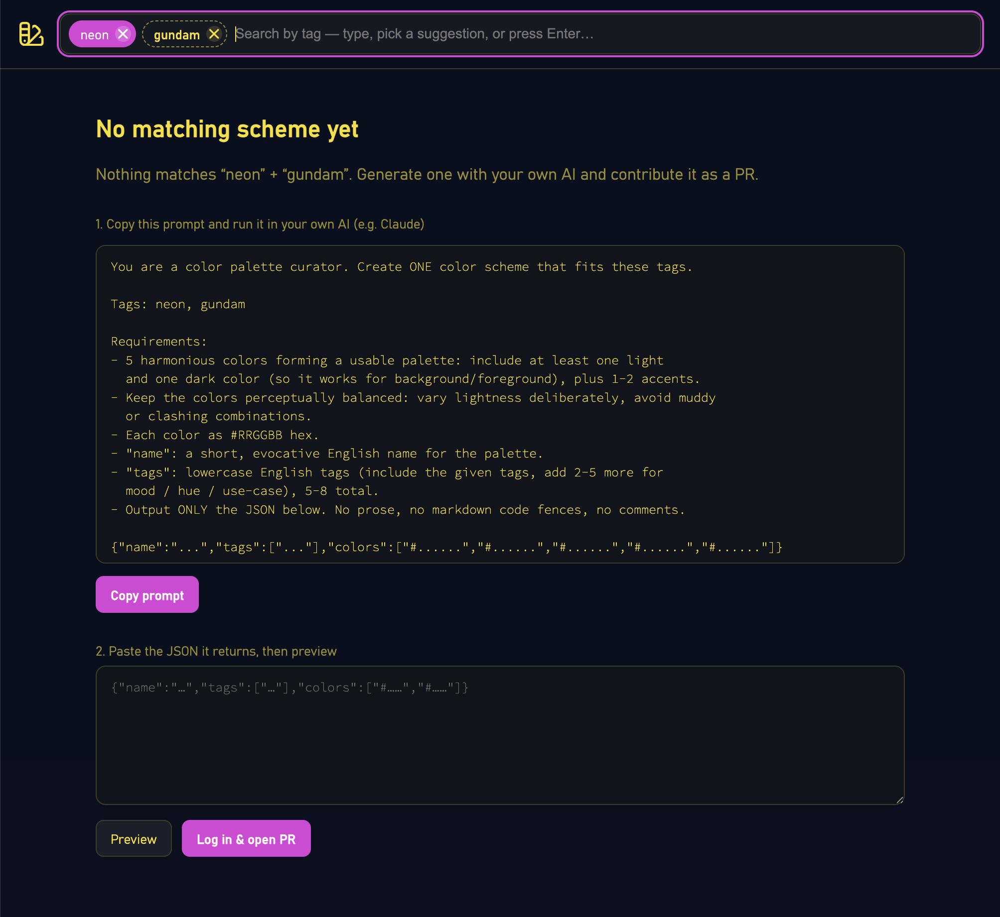

タグで配色を絞り込めるカラースキーム集 **[color.recipes](https://color.recipes)** を公開しました。

気に入った配色は各種形式でダウンロード・コピーできます。

GitHub の公開リポジトリでスキームを管理しているので、無い組み合わせは自分で作って PR で追加できます。

<!--more-->

## モチベーション

同じような配色サービスは既にいくつもあります。

ただ、余分な機能が付いていたり、広告が出ていたりするものばかりで、気に入ったものがありませんでした。

自分にあった、気持ちよく使える、シンプルなカラースキーム集を目指して、このソフトウェアを作り始めました。

## つかいかた

- **タグで絞り込む**。複数選ぶと、その全部に当てはまる配色だけに絞れます（例: `winter` と `city` の両方）。
- 気に入った配色は **CSS・SCSS・Tailwind・JSON・SVG・Swift など各種形式でダウンロード・コピー**できます。
- 各配色に **パーマリンク**があります。共有すると、その配色のサムネイル（OpenGraph 画像）が出ます。

### 無い組み合わせは、自分で作って PR

検索してゼロ件だったときは、その場で配色を作って追加できます。

1. 表示される **AI 用プロンプトをコピー**する
2. 手元の生成 AI に貼って、配色 JSON を作らせる
3. その JSON を貼り戻すと、**その場でプレビュー**できる
4. GitHub でログインし、**Fork 先（自分のアカウント or org）を選ぶ**
5. ボタンひとつで **Fork → コミット → PR** まで作られる

配色データはリポジトリの `schemes/*.json` に置かれているだけなので、投稿は「JSON を 1 ファイル足す PR」になります。

## フィードバックのお願い

フィードバックは GitHub Issue で受け付けています。不具合や気づいたことがあれば登録してください。

それから、**新しい配色の登録 PR をぜひお願いします**。リポジトリはこちらです。

**https://github.com/ngs/color.recipes**
